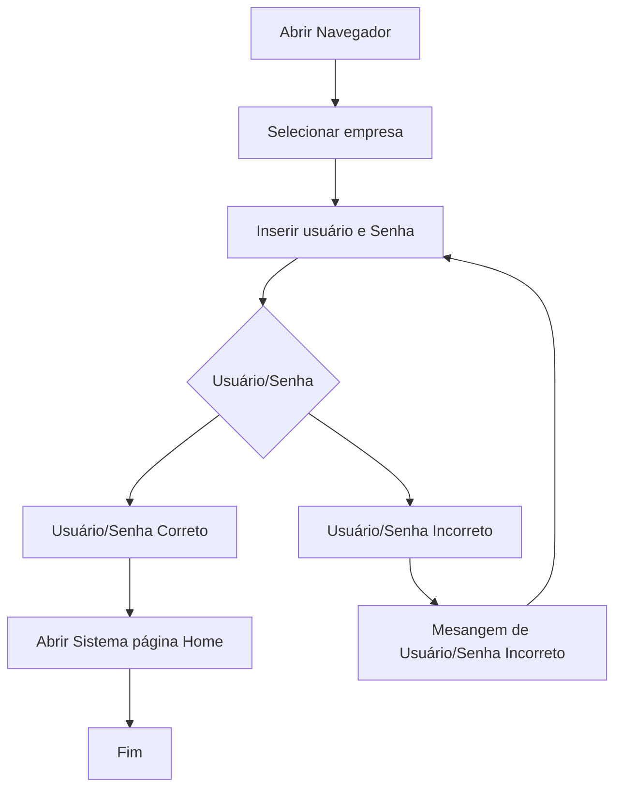

# LogarSistemaROBOT

-> pip install python

# Extensões VSCODE

-> RobotF Extension - KMK Labs

-> Python - Microsoft

-> Pylance

```mermaid
flowchart TD;
  A[Abrir Navegador]-->B[Selecionar empresa]-->C[Inserir usuário e Senha];
  C-->D{Usuário/Senha};
  D-->E[Usuário/Senha Correto];
  D-->F[Usuário/Senha Incorreto];
  E-->G[Abrir Sistema página Home];
  F-->H[Mesangem de Usuário/Senha Incorreto];
  G-->I[Fim];
  H-->C;
```
